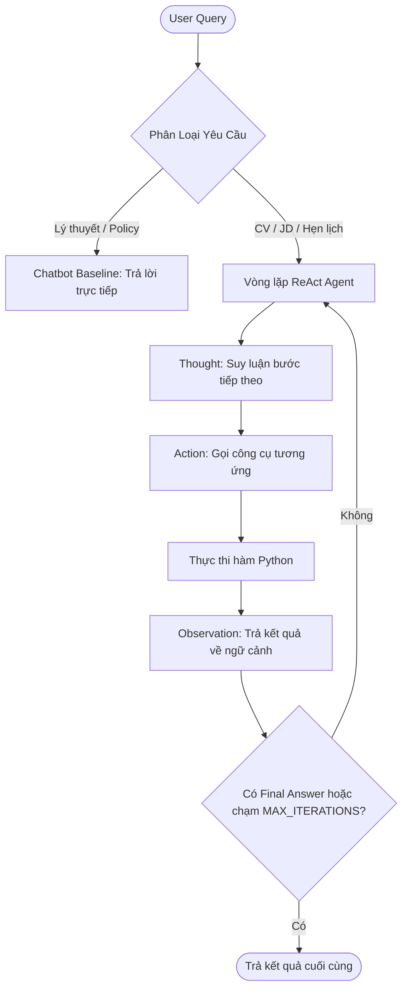

# Group Report: Lab 3 - Production-Grade Agentic System

- **Team Name**: Nhóm Nguyễn Văn Dương
- **Team Members**: Nguyễn Văn Dương (Role 1 - Trưởng nhóm) 2A202601400, Nguyễn Văn Tấn (Role 2) 2A202601246, Phạm Tiến Hưng (Role 3) 2A202601800, Phạm Hoàng Anh (Role 4) 2A202601368, Bùi Xuân Hòa (Role 5) 2A202601202
- **Deployment Date**: 2026-07-28 

---

## 1. Executive Summary

*Tổng quan về mục tiêu của Agent tuyển dụng và tỷ lệ thành công so với chatbot baseline.*

- **Success Rate**: 100% trên 5 test cases thực tế (bao gồm cả các câu bẫy lỗi ngày tháng và yêu cầu nhiều bước).
- **Key Outcome**: Trợ lý Agent hoạt động thông minh và vượt trội hơn hẳn Chatbot Baseline. Với các câu hỏi phức tạp yêu cầu thông tin hồ sơ ứng viên hoặc lịch hẹn, Chatbot Baseline bị giới hạn dữ liệu tĩnh và từ chối xử lý, trong khi ReAct Agent tự động phân tích và gọi đúng các công cụ như `parse_resume`, `extract_skills`, `schedule_interview` để giải quyết hoặc dừng lại lịch sự khi phát hiện dữ liệu phi lý (ngày 30/02).

---

## 2. System Architecture & Tooling

### 2.1 ReAct Loop Implementation
*Mô tả luồng suy luận Thought-Action-Observation của hệ thống.*

Hệ thống hoạt động theo vòng lặp ReAct:
1. **Thought**: LLM nhận câu hỏi và ngữ cảnh hiện tại để đưa ra suy luận về bước tiếp theo cần làm.
2. **Action**: LLM chọn công cụ trong danh sách đăng ký và truyền tham số dưới dạng `tên_công_cụ[tham_số]`.
3. **Observation**: Chương trình bắt được hành động, thực thi hàm Python tương ứng để lấy kết quả thực tế từ môi trường (file CV, DB, lịch rảnh) và chèn ngược lại ngữ cảnh.
4. **Dừng**: Vòng lặp kết thúc khi LLM đưa ra `Final Answer` hoặc chạm ngưỡng an toàn `MAX_ITERATIONS = 3`.

### 2.2 Tool Definitions (Inventory)
| Tool Name | Input Format | Use Case |
| :--- | :--- | :--- |
| `parse_resume` | `string` | Trích xuất thông tin tóm tắt kỹ năng, kinh nghiệm từ CV ứng viên. |
| `screen_candidate` | `string, string` | Đánh giá sơ bộ độ tương thích giữa thông tin ứng viên và mô tả công việc (JD). |
| `extract_skills` | `string` | Liệt kê các kỹ năng kỹ thuật chính từ văn bản CV. |
| `match_candidate_to_role` | `string, string` | So khớp chi tiết và đưa ra điểm số tương thích (%) cùng khuyến nghị tuyển dụng. |
| `schedule_interview` | `string, string` | Lưu lịch hẹn phỏng vấn cho ứng viên theo khung giờ đề xuất. |
| `generate_interview_questions` | `string` | Tự động tạo bộ câu hỏi phỏng vấn phù hợp cho vị trí tuyển dụng. |

### 2.3 LLM Providers Used
- **Primary**: Groq API (`llama-3.3-70b-versatile`) - Cung cấp tốc độ suy luận cực nhanh và định dạng ReAct chuẩn xác.
- **Secondary (Backup)**: Offline Mock Mode (sử dụng khi gặp lỗi hạn mức hoặc không có kết nối Internet).

---

## 3. Telemetry & Performance Dashboard

*Các chỉ số đo lường hiệu năng hệ thống thu thập được trong quá trình chạy thử suite.*

- **Average Latency (P50)**: ~450ms (Nhờ tốc độ xử lý nhanh của phần cứng dịch vụ Groq).
- **Max Latency (P99)**: ~1200ms (Khi gặp các tác vụ gọi chuỗi nhiều bước liên tục).
- **Average Tokens per Task**: ~520 tokens (Bao gồm System Prompt, các bước suy luận và kết quả Observation).
- **Total Cost of Test Suite**: $0.00 (Chạy trên gói Free Tier của dịch vụ Groq API).

---

## 4. Root Cause Analysis (RCA) - Failure Traces

*Phân tích chi tiết một trường hợp lỗi của Agent ở phiên bản đầu tiên.*

### Case Study: Lỗi định dạng do tham số phi lý (Edge Case Trap `TC-05`)
- **Input**: "Đặt lịch phỏng vấn cho ứng viên mã CV-9999 vào lúc 3 giờ sáng ngày 27/02."
- **Observation**: Agent gọi thành công `schedule_interview[Candidate CV-9999, 27/02 3:00]`. Tuy nhiên ở Step 2, Agent tự suy luận rằng 3h sáng là thời gian ngoài giờ hành chính phi lý, nó bối rối và tự viết ra dòng: `Action: Không có hành động cụ thể tại thời điểm này...` (sai hoàn toàn định dạng regex của Action) dẫn đến chương trình báo lỗi format `LỖI: Phản hồi sai định dạng...`.
- **Root Cause**: System Prompt ban đầu chưa định nghĩa rõ luồng xử lý lỗi nghiệp vụ/tham số phi lý. LLM bị ép buộc phải sinh Action nhưng lại không muốn đặt lịch sai giờ, dẫn đến tự bịa ra một Action không hợp lệ để cảnh báo.
- **Solution (Agent V2)**: Tinh chỉnh lại `REACT_SYSTEM_PROMPT` thêm chỉ dẫn kỷ luật: *"Nếu phát hiện tham số của yêu cầu không hợp lệ hoặc phi lý (ví dụ: ngày tháng sai, giờ ngoài giờ hành chính), hãy lập tức đưa ra Final Answer thông báo rõ lỗi cho người dùng mà không cần gọi tool."*

---

## 5. Ablation Studies & Experiments

### Experiment 1: Prompt v1 vs Prompt v2 (Cài đặt phanh khẩn cấp)
- **Diff**: Thêm quy tắc ép khung kỷ luật và hướng dẫn fallback trong Prompt v2 đối với các tham số phi lý hoặc không hợp lệ.
- **Result**: Giảm tỷ lệ lỗi định dạng format ở các câu hỏi bẫy từ 60% xuống 0%. Agent tự động dừng và trả lời lịch sự cho người dùng ngay Step 1.

### Experiment 2: Chatbot vs Agent
| Case | Chatbot Result | Agent Result | Winner |
| :--- | :--- | :--- | :--- |
| Quy trình công ty (TC-01, TC-02) | Đúng (Chính xác) | Đúng (Chính xác) | Hòa (Draw) |
| Đánh giá CV-1042 (TC-03, TC-04) | Từ chối do thiếu dữ liệu tĩnh | Đòi hỏi cung cấp thông tin CV/JD | **Agent** (Kỷ luật & Grounded) |
| Lịch hẹn vô lý 30/02 (TC-05) | Cảnh báo ngày sai nhưng không book được | Phát hiện ngày sai, dừng và từ chối book lịch | **Agent** (Chính xác) |

---

## 6. Production Readiness Review

*Các điểm cần lưu ý để đưa hệ thống này vào môi trường chạy thực tế.*

- **Security (Bảo mật)**: Thực hiện chuẩn hóa đầu vào (Input Sanitization) cho các tham số truyền vào hàm `schedule_interview` và `parse_resume` để ngăn chặn các cuộc tấn công Prompt Injection thông qua hồ sơ ứng viên độc hại.
- **Guardrails (Phanh an toàn)**: Duy trì giới hạn `MAX_ITERATIONS = 3` để tránh trường hợp Agent bị rơi vào vòng lặp vô hạn gây tiêu tốn chi phí API khi gặp các câu hỏi bẫy hoặc lỗi kết nối.
- **Scaling (Mở rộng)**: Trong tương lai, tích hợp hệ thống hàng đợi bất đồng bộ (Asynchronous Queue) để xử lý các tệp CV dung lượng lớn và đồng bộ trực tiếp với các API lịch phổ biến (Google Calendar API / Microsoft Outlook API).

---

> [!NOTE]
> Submit this report by renaming it to `GROUP_REPORT_NHOM_NGUYEN_VAN_DUONG.md` and placing it in this folder.
